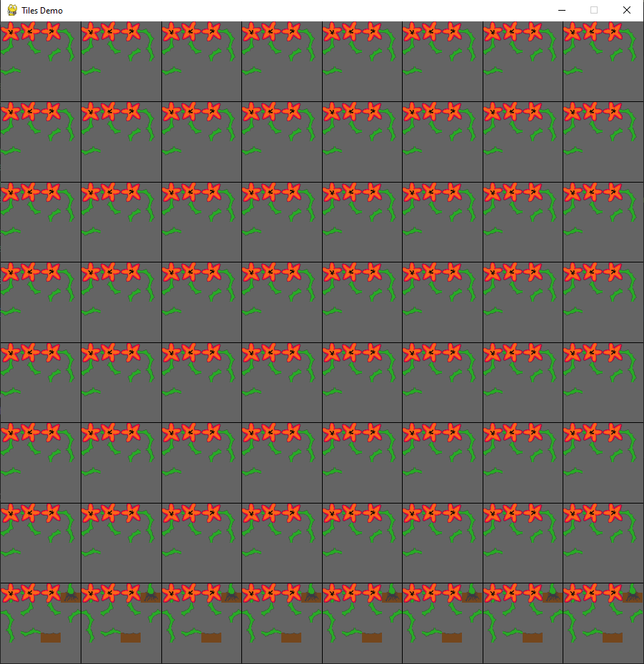
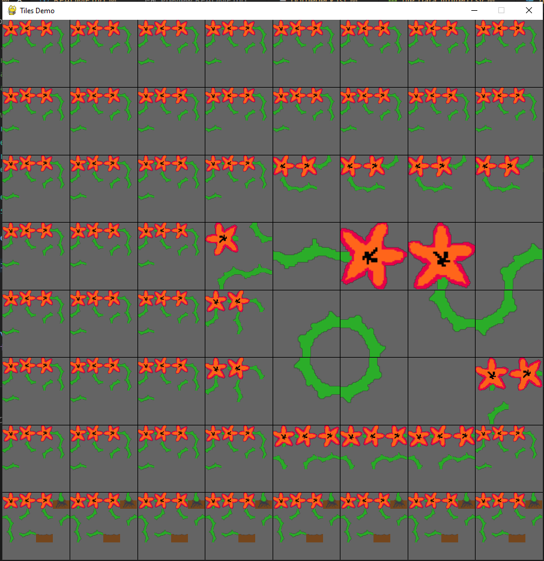
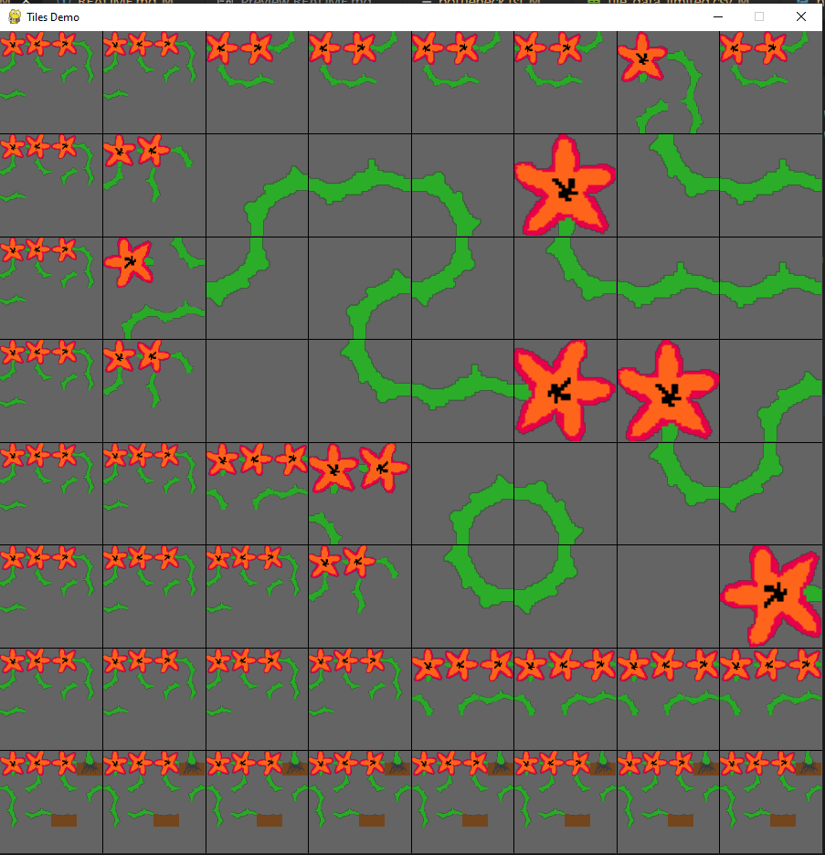
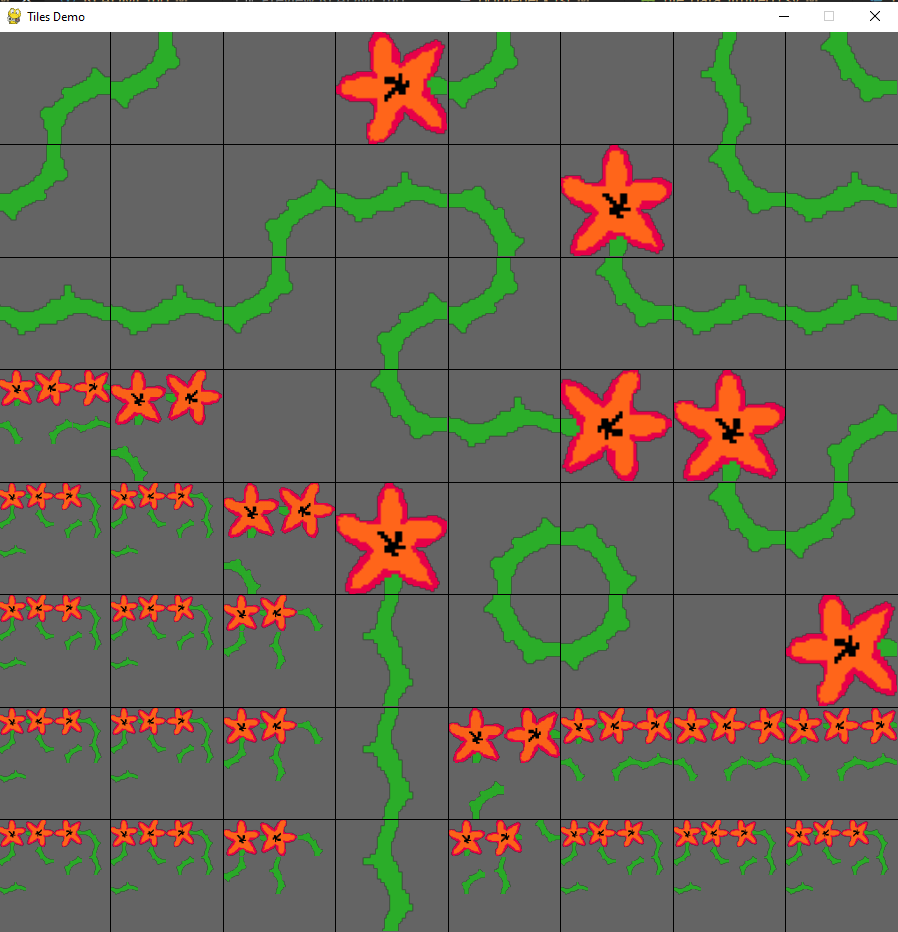
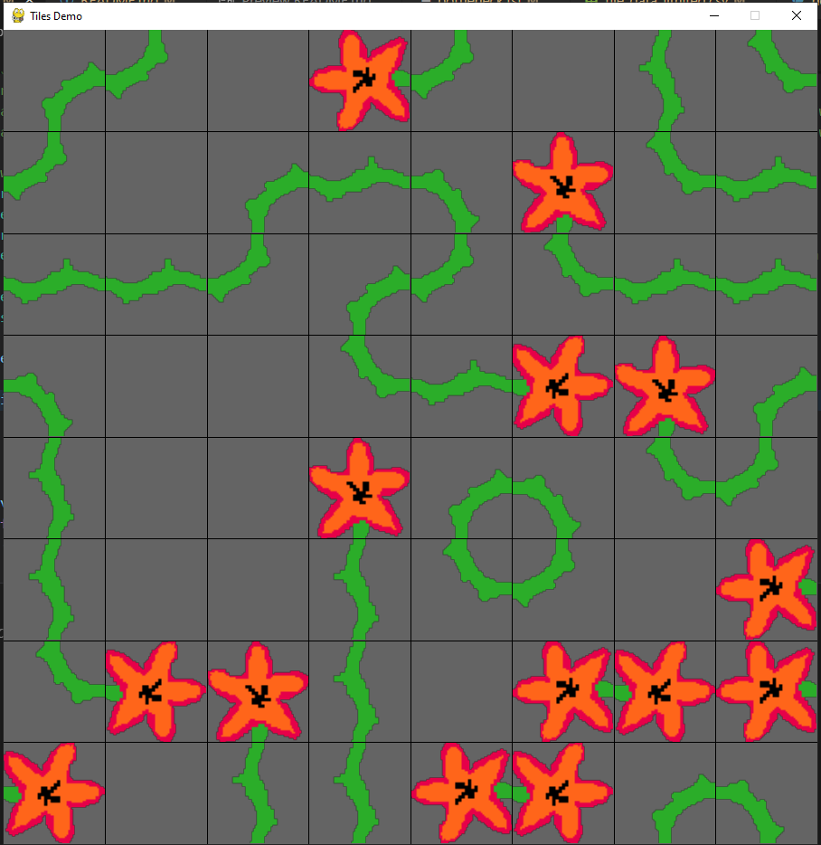
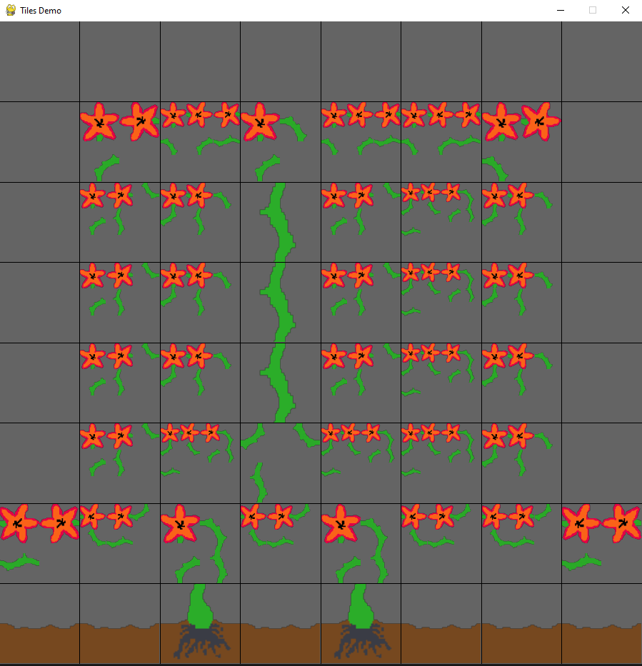
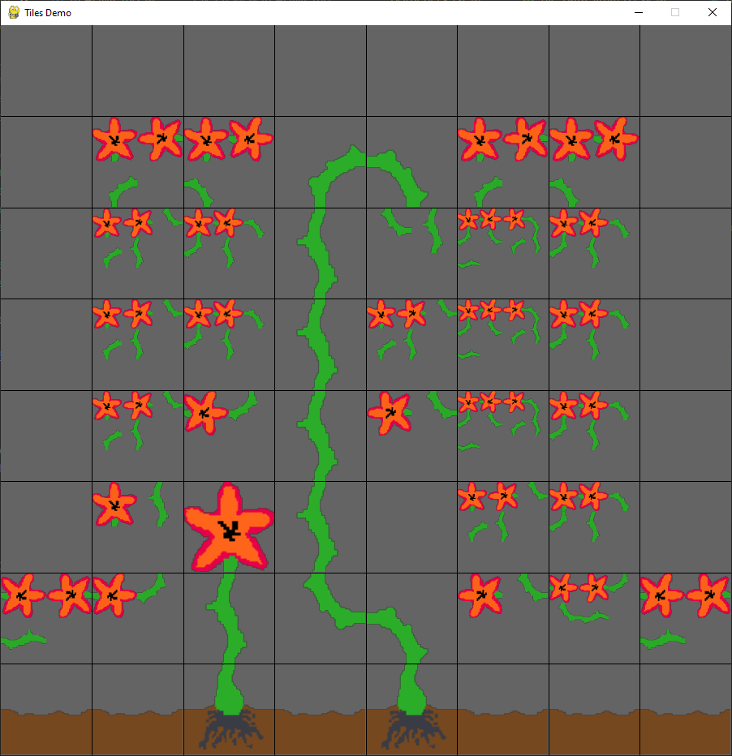
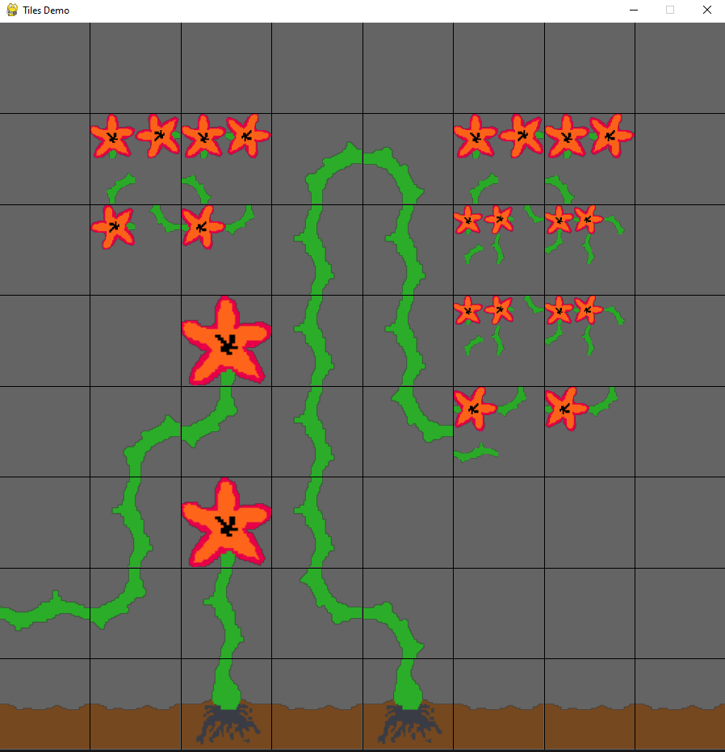
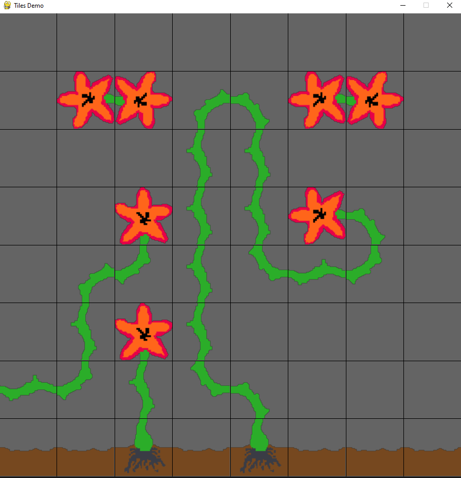

A project in which I try to place tiles correctly under constraints. In the current state (20/08/2022) the only constraints are local adjacency constraints, but I have thoughts of how to implement global ones such as a tile-group requiring connection to a certain tile (e.g. the ground in the flower example, so they don't float about).

## See it for yourself:
Run the `WFC_tile_metadata.ipynb` notebook. Advance with space. Exit with escape. 

## Sample output (`flower_tiles`)
The smaller tiles represent the set of possible outcomes of that tile. Notice how initially the bottom row could be soil, but not later on, as a stalk has been placed in that row. Pressing space will take one of those undecided tiles with fewest options and choose one randomly, propagating the new constraint to its adjacent tiles. This can lead to multiple tiles being placed with a single space-press, because of limited options.






<p style="clear: both;">

## Using TileSetupFiles (`.tsf`) to impose constraints on initizaliation
In the above flower example, we never got to see any ground. We just got unlucky, but what if we would like it to be guaranteed?
A TileSetupFile fixes this - it specifies where to get the tile images, references a `.csv` about how they can tile, and the fixed board-data
In the notebook you can specify what .tsf to read.
<details>
<summary style="font-size:23px">  .tsf SPECIFICATION (OPEN ME IF YOU THINK THIS MIGHT BE COOL) </summary>

```text
dataFolder:flower_tiles    # <- where the tiles are located
data:tile_data_limited.csv # <- filename of tile specification, such as permitted rotations and how they fit together

g:soil 0
r:root 0     # <- user defined abbreviations
i:straight 0
a:air 0

8x8          # <- size of the map in tiles (height x width)
aaaaaaaa
a      a
a  i   a
a  i   a     # <- this is the map that is produced
a  i   a
a      a

ggrgrggg
```
</details>

<br>

## `.tsf` example

The above `.tsf` (without comments) initially produces this layout:



If we advance the constraint propagation by choosing randomly from the possible tiles, we end up with something like this (random outcome).





<p style="clear: both;">

_[After 7 space-presses; after 10 more; until finished]:_

## Credit
Shoutout to pygame and mxgmn